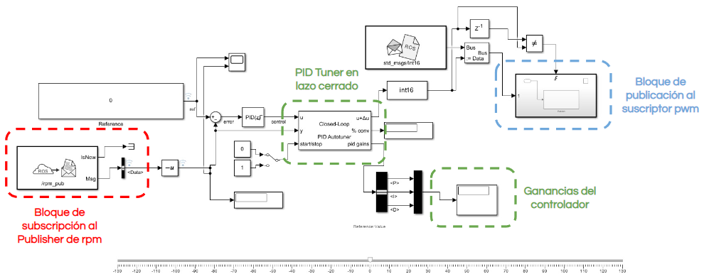

## Projects made throughout my career

---

### FPGA-controlled cyber-physical Pong game

This project was done in collaboration with Intel and consisted of making an application-specific cyber-physical system using an FPGA.

In this team project, a Pong game was made in Processing and controlled by the FPGA using the built-in accelerometer and an infrared sensor. I contributed mainly by writing the code for the FPGA to function as the contol unit, specifically DE10-Lite Altera MAX 10 FPGA model, using VHDL as the hardware descriptor language and Intel Quartus Prime as the software design.

---

### Microcontroller-based gas detection safety system

For this team project, made in collaboration with Intel, a digital system for gas detection and measurement of environmental variables for alarm activation and a ventilation system was designed and prototyped, in addition to a dashboard showing the levels of the measured variables.

I contributed in this project collaborating in the writing of the code in C for the ATMega16 microcontroller to use and coordinate several of its components and functions such as: Timers, GPIOs, Serial communication (UART), PWM and interrupts. In addition, I was in charge of the selection of the system components (bill of material).

  <em> Block diagram </em> 
 
  <em> Flowchart </em> 

---

### Smart framework for air pressure control in agricultural equipment

This project consisted of the design and development of a system to measure the pressure of a tire and adjust it to the desired value by the user through a physical interface and a remote graphical interface (dashboard). The objective of this was to be able adapt the tires of John Deere vehicles to the conditions of the terrain and thus maximize their lifespan.

In this project we worked with a development board with an STM32 microcontroller, in which we implemented a real-time closed-loop PID control system (RTOS), using FreeRTOS, and an ESP32 to send data to a remote server using the MQTT protocol. The CAN protocol was implemented between the STM32 and the ESP32 to send and receive tire pressure data. As an extra, a Fourier analysis was implemented to compensate the noise caused by the air pump in the pressure measurement.

---

### Closed-loop control system for a DC motor using ROS

This project consisted of designing and implementing a closed-loop control system for speed and position of a DC motor in conjunction with ROS.

The controller was implemented in a Simulink model, which received the reference through a slider and the motor velocity and position feedback through subscription nodes. In addition, it sent the PWM control signal through the pubisher node to the motor. The DC motor was connected to a development board with an ATMega256 microcontroller to calculate the position and velocity of the motor. It received the control PWM signal through a subscriber node and sent the position and velocity values through a publisher node.

In this project I contributed writing the C code to make the motor speed and position measurements, as well as adjusting the controller gains using methods such as Ziegler-Nichols and Root Locus.

  
  <em>Controlador de velocidad en MATLAB </em>

---

<!-- Remove above link if you don't want to attibute -->
