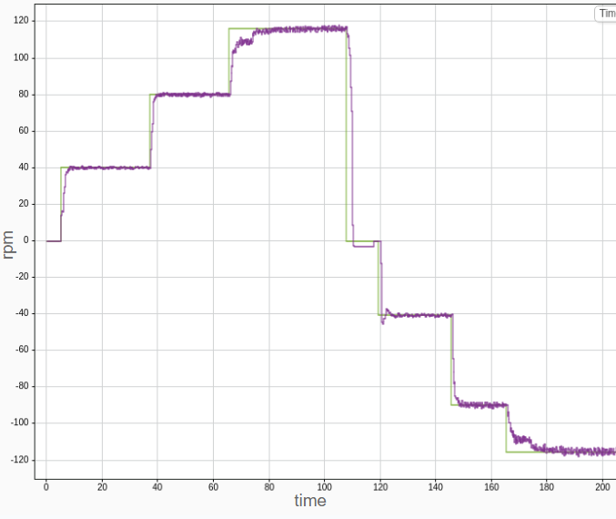
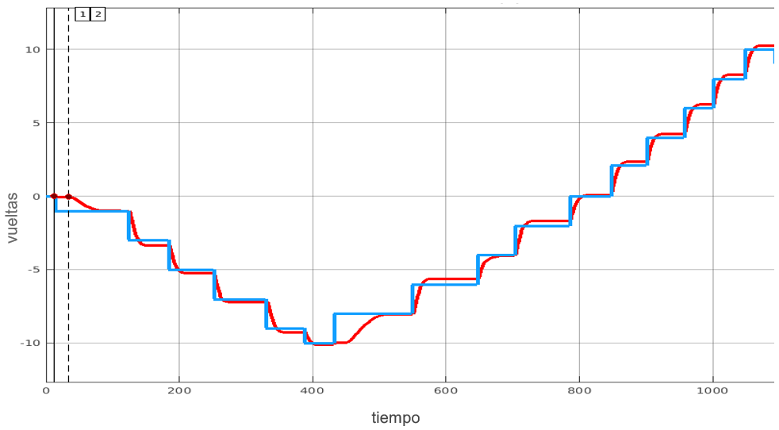

## Projects made throughout my career

---

### FPGA-controlled cyber-physical Pong game

Project made in collaboration with Intel.

This project consisted of making an application-specific cyber-physical system using an FPGA.

In this team project, a computer Pong game was made in Processing and controlled by the FPGA using the built-in accelerometer and an infrared sensor. Data from the FPGA was sent  via serial (UART) to the computer. I contributed mainly by writing the code for the FPGA to function as the contol unit, specifically DE10-Lite Altera MAX 10 FPGA model, using VHDL as the hardware descriptor language and Intel Quartus Prime as the software design.

<figure>
  
  <figcaption>FPGA with accelerometer values</figcaption>
</figure>

This project was taken up again later on, making a game similar to Duck Hunter for cell phones, again using the FPGA as the controller. In this case the FPGA was used with a joystick and the data was sent via serial (UART) to the bluetooth module and the cell phone. Once again, I contributed by writing the FPGA code to work as a Mealy machine with the inputs of the joystick. Also, I was in charge of the game programming in Processing.

<figure>
  
  
  <figcaption>Duck hunter videogame made in Processing</figcaption>
</figure>

---

### Smart framework for air pressure control in agricultural equipment

Project done in collaboration and supervised by John Deere.

This project consisted in the design and development of a system to measure the pressure of a tire and adjust it to the desired value by the user through a remote graphical interface (dashboard). The objective of this was to be able adapt the tires of John Deere vehicles to the conditions of the terrain and thus maximize their lifespan.

To achieve this team project, my teammates and I used a development board with an STM32 microcontroller, in which we implemented a closed-loop PID control system, and an ESP32 to send data to a remote server using the MQTT protocol. Also, we implemented the CAN protocol between the STM32 and the ESP32 to send and receive tire pressure data. As an extra, a Fourier analysis was implemented to compensate the noise caused by the air pump in the pressure measurement. In addition, to make the project more reliable and professional, we implemented the control system in real-time using FreeRTOS, and use multicore programming to separate the system tasks in two cores.

In this project I collaborated designing the control system with MATLAB and programming it in C for the STM32 microcontroller. Also, I assisted in the multicore and RTOS implementation. In addition, I was in charge in writing the C program for frequency analysis, specifically implementing the Fast Fourier Transform.

<figure> 
  
  <figcaption>Closed-loop control system diagram</figcaption>
</figure>

<figure>
  
  <figcaption>Electric diagram</figcaption>
</figure>

<figure>
  
  <figcaption>Frequency analysis results</figcaption>
</figure>

<figure>
  
  <figcaption>Remote server dashboard</figcaption>
</figure>

---

### Closed-loop control system for a DC motor using ROS

Project made in collaboration with Manchester Robotics.

This project consisted of designing and implementing a closed-loop control system for speed and position of a DC motor for a mobile robot wheel in conjunction with ROS.

The controller was implemented in a Simulink model, which received the reference through a slider and the motor velocity and position feedback through subscription nodes. Then, the controller sent a PWM control through the pubisher node to the motor. The DC motor was connected to a development board with an ATMega256 microcontroller to calculate the position and velocity of the motor. It received the control PWM signal through a subscriber node and sent the position and velocity values through a publisher node. For the velocity control, a PI controller was implemented, while for the position control, a PID controller was implemented.

In this project I contributed by writing the C program to make the motor velocity and position measurements and making the electric circuit between the DC motor and the development board. In addition, I was in charge of tunning both controller gains using methods such as Ziegler-Nichols and Root Locus to obtain the best to obtain a control that came as close as possible to the reference.

<figure>
  
  <figcaption>MATLAB velocity controller</figcaption>
</figure>

<figure>
  
  <figcaption>Velocity result with PI controller</figcaption>
</figure>

<figure>
  
  <figcaption>MATLAB position controller</figcaption>
</figure>

<figure>
  
  <figcaption>Position result with PID controller</figcaption>
</figure>

---

### Design of a dedicated controller for an electric vehicle

Project made for Shell Eco-Marathon competition.

Shell Eco-Marathon competition is an event organized by Shell in which teams from different universities around the world design and build a vehicle that can travel the longest distance using the least amount of energy. I was part of Borregos CCM, my univeristy's team, for this competition in the season 2022-2023. Our team participated in the Prototype Battery Electric category. I was part of different areas such as physical design and manufacturing of the vehicle, but where I was most involved was in the electronic and telemetry area.

For the vehicle of the 2022-2023 season, three PCBs were designed, two for the dedicated control and one for the telemetry. In both circuits, we used an ESP32-S3 as the main microcontroller. During the design and implementation of the electronic systems, I helped in the design of the dedicated control based on a Field Oriented Control for a three-phase motor. For the 2022-2023 season, we used the Texas Instrument DRV8350RS as the motor driver. The control was implemented in a ESP32-S3, using the Espressif official IoT Development Framework (ESP-IDF) and PlatformIO IDE. Specifically, I was in charge of the communication between the ESP32-S3 and the DRV8350RS driver, using SPI interface. I developed the necessary functions to configure and check the driver registers in order to control the motor. Also, I was in charge of the communication between the two ESP32-S3 and the steering wheel, which had the telemetry system. For this, I used the CAN protocol, in which I developed the necessary functions to send and receive data. In addition, I collaborated in the physical part of electronics, soldering the necessary components to the PCBs and assembling the vehicle's electrical circuit. 

---

### Microcontroller-based gas detection safety system

Project supervised by Intel.

For this team project a digital system for gas detection and measurement of environmental variables for alarm activation and a ventilation system was designed and prototyped, in addition to a dashboard showing the levels of the measured variables.

To develop this project, the ATMega32 microcontroller was used to read and process the sensor measurements and to desaplay them in a LCD. My teammates and I used a MQ3-alchohol sensor, a MQ135-CO_2 sensor and a LM35-temperature sensor. When one of these sensor detected a dangerous level of gas or temperature, the microcontroller activated a fan to ventilate the area, through a H-Bridge, and an alarm. Also, via bluetooth, the microcontroller sent the measurments to a computer to be displayed the gases levels in a dashboard in real time.

I contributed in this project collaborating in the writing of the code in C for the ATMega32 microcontroller to use and coordinate several of its components and functions such as: Timers, GPIOs, Serial communication (UART), PWM and interrupts. In addition, I was in charge of the development of the data processing algorithm and the choice of components for the circuit (Bill of Materials).

<figure>
  
  <figcaption>Gas detector system block diagram</figcaption>
</figure> 

<figure>
  
  <figcaption>Gas detector system flowchart </figcaption>
</figure>
 
<figure>
  
 <figcaption>Electric diagram </figcaption>
</figure>

<figure>
  
 <figcaption>Resulting gas detector circuit</figcaption>
</figure>

<figure>
  
 <figcaption>Final prototype of gas detector system</figcaption>
</figure>

<figure>
   
   
   
 <figcaption>Final prototype of gas detector system</figcaption>
</figure>

---